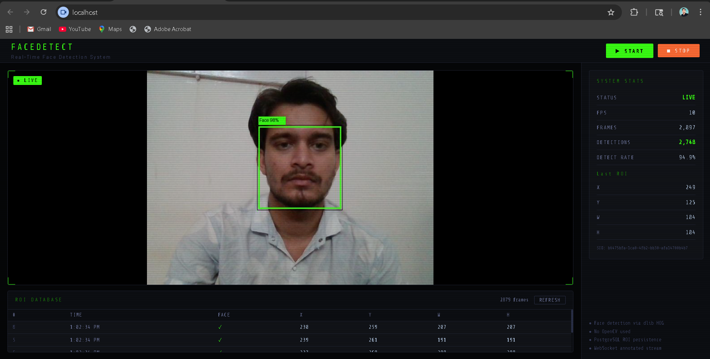

<div align="center">

# 🎯 FACEDETECT &nbsp; 

# Real-Time Face Detection & Video Streaming System

### 🟢 Live · Containerised · Production-Ready

<br/>

[](https://python.org)
[](https://fastapi.tiangolo.com)
[](https://react.dev)
[](https://postgresql.org)
[](https://docker.com)
[](https://mediapipe.dev)
[]()
[](LICENSE)

<br/>

> A fully containerised system that accepts a **live webcam feed**, detects faces in real-time using **MediaPipe** *(zero OpenCV)*, draws axis-aligned bounding boxes with **Pillow**, persists ROI data to **PostgreSQL**, and streams annotated frames to a **React** frontend over **WebSocket**.

<br/>

| 🎯 94.9% Detection Rate | ⚡ 10 FPS | 🟢 <50ms Latency | 🗄️ Full ROI Persistence |
|:-:|:-:|:-:|:-:|

</div>

---

## 📸 Demo



---

## ⚡ Quick Start

> **One command. That's it.**

```bash
git clone https://github.com/adityakr09/facedetect.git
cd facedetect
cp .env.example .env
docker compose up --build
```

Then open **http://localhost** → Click **▶ Start** → Allow camera → Watch it detect! 🔥

> ⏱️ First build ~10 min (MediaPipe compiles from source). Subsequent starts are instant.

---

## 🏗️ Architecture


```
┌─────────────────────────────────────────────────────────────┐
│                    Docker Compose Network                    │
│                                                              │
│   Browser ──► Nginx :80 ──────► FastAPI Backend :8000       │
│      │                │               │            │        │
│      │           React SPA       WebSocket      REST API    │
│      │           (frontend)      /stream     /feed  /roi    │
│      │                               │            │         │
│      └──── Annotated JPEG ◄──────────┘       PostgreSQL 16  │
│             (WebSocket)                      sessions       │
│                                              frames         │
│                                              rois (AABB)    │
└─────────────────────────────────────────────────────────────┘
```

| 🐳 Service | Image | Role |
|-----------|-------|------|
| `nginx` | nginx:1.25-alpine | Reverse proxy, WS upgrade, single ingress |
| `backend` | python:3.12-slim | FastAPI + MediaPipe + Pillow annotation |
| `frontend` | node:20 → nginx | React SPA (multi-stage build) |
| `db` | postgres:16-alpine | Relational ROI storage with Alembic migrations |

---

## 🔌 API Reference

### Endpoint 1 — 📥 Receive Video Feed

```http
POST /api/v1/feed/start
POST /api/v1/feed/{session_id}        ← multipart JPEG
POST /api/v1/feed/{session_id}/stop
```

**Response (push frame):**
```json
{
  "frame_index": 42,
  "face_detected": true,
  "roi": { "x": 249, "y": 125, "width": 184, "height": 184 }
}
```

### Endpoint 2 — 📡 Serve Annotated Stream

```
WS /api/v1/stream/{session_id}
```

Binary WebSocket messages — raw annotated JPEG bytes with **lime-green AABB** drawn by Pillow. **Zero OpenCV.**

### Endpoint 3 — 📊 Serve ROI Data

```http
GET /api/v1/roi/{session_id}?skip=0&limit=100
GET /api/v1/roi/{session_id}/latest
GET /health
```

**Response:**
```json
{
  "session_id": "uuid",
  "total": 2897,
  "items": [
    {
      "frame_index": 42,
      "face_detected": true,
      "roi": { "x": 249, "y": 125, "width": 184, "height": 184, "confidence": 0.98 }
    }
  ]
}
```

---

## 🗄️ Database Schema

```sql
sessions ──────────────────────────────────────────────────
  id            UUID        PRIMARY KEY
  started_at    TIMESTAMPTZ
  ended_at      TIMESTAMPTZ NULL
  client_ip     VARCHAR(45)
      │
      └── frames ────────────────────────────────────────────
            id            BIGINT      PRIMARY KEY
            session_id    UUID        FK → sessions (CASCADE)
            frame_index   INT
            width/height  INT
            face_detected BOOLEAN
            captured_at   TIMESTAMPTZ
                │
                └── rois ────────────────────────────────────
                      id            BIGINT  PRIMARY KEY
                      frame_id      BIGINT  FK → frames (CASCADE, UNIQUE)
                      x, y          INT     ← top-left origin
                      width, height INT     ← axis-aligned bounding box
                      confidence    FLOAT
                      detected_at   TIMESTAMPTZ
```

> Migrations auto-run via **Alembic** on container start. One ROI per frame, cascade deletes, indexed FKs.

---

## 🧠 Detection Pipeline

```
📷 Webcam
    │  JPEG (multipart)
    ▼
FastAPI /feed/{id}
    │
    ├── Pillow decode → RGB numpy array
    │
    ├── MediaPipe FaceDetection
    │     model_selection=0 (short-range, CPU)
    │     min_confidence=0.5
    │
    ├── Relative bbox → absolute pixel coords
    │
    ├── Pillow ImageDraw.rectangle ← LIME GREEN, 3px
    │     ⚠️  Zero OpenCV
    │
    ├── JPEG encode → asyncio.Queue
    │
    ├── PostgreSQL INSERT (frame + roi)
    │
    └── WebSocket → Browser →  render
```

---

## 🛡️ Security

- ✅ CORS restricted via `CORS_ORIGINS` env var
- ✅ `client_max_body_size 5m` at Nginx
- ✅ JPEG content-type validated before processing
- ✅ PostgreSQL not exposed on host network
- ✅ All secrets in `.env` — never committed
- ✅ `X-Real-IP` / `X-Forwarded-For` forwarded correctly
- ✅ WebSocket slow-client protection (frame drops, not stalls)

---

## ⚙️ Configuration

```bash
cp .env.example .env
```

| Variable | Default | Notes |
|----------|---------|-------|
| `POSTGRES_USER` | `facedetect` | |
| `POSTGRES_PASSWORD` | `facedetect_secret` | ⚠️ Change in prod |
| `POSTGRES_DB` | `facedetect` | |
| `SECRET_KEY` | `supersecret...` | ⚠️ Change in prod |
| `LOG_LEVEL` | `info` | debug/info/warning/error |
| `HOST_PORT` | `80` | Nginx host port |

---

## 🧪 Tests

```bash
docker compose exec backend pytest -v
```

| Test | Coverage |
|------|----------|
| `test_returns_result_with_no_face` | Detection service — no face |
| `test_returns_bbox_when_face_detected` | Bbox coordinates math |
| `test_invalid_bytes_raises_value_error` | Error handling |
| `test_annotated_jpeg_is_valid` | Output JPEG validity |
| `test_roi_clamped_to_image_bounds` | Edge case — bbox overflow |
| `test_right_and_bottom` | BoundingBox properties |
| `test_create_and_get` | Session store lifecycle |
| `test_health` | API health endpoint |
| `test_push_frame_unknown_session` | 404 handling |
| `test_push_frame_wrong_content_type` | 415 handling |

---

## 📁 Structure

```
facedetect/
├── 📁 backend/
│   ├── 📁 app/
│   │   ├── 📁 api/          # feed.py · stream.py · roi.py · health.py
│   │   ├── 📁 core/         # config.py · logging.py
│   │   ├── 📁 db/           # session.py · models.py
│   │   ├── 📁 models/       # schemas.py (Pydantic)
│   │   ├── 📁 services/     # detection.py · session_store.py
│   │   ├── 📁 tests/        # test_api.py
│   │   └── main.py
│   ├── 📁 alembic/          # async migrations
│   ├── Dockerfile
│   └── requirements.txt
├── 📁 frontend/
│   ├── 📁 src/
│   │   ├── 📁 components/   # VideoPanel · StatsPanel · ROITable
│   │   ├── 📁 hooks/        # useCamera · useStreaming
│   │   ├── 📁 utils/        # api.js
│   │   └── App.jsx
│   └── Dockerfile
├── 📁 nginx/nginx.conf
├── 📁 scripts/init.sql
├── 🐳 docker-compose.yml
├── 🔐 .env.example
└── 📖 README.md
```

---

## 🤖 AI Collaboration Disclosure

Built with **Claude (Anthropic)** assistance. AI generated initial boilerplate for FastAPI routers, SQLAlchemy models, Alembic migrations, MediaPipe wrapper, Pillow annotation, and React hooks. All code reviewed, debugged, integrated, and tested by the developer. Architecture, schema design, debugging, and deployment directed by developer.

---

<div align="center">

**Built by Aditya Kumar · 2026**

[](https://github.com/adityakr09)

</div>
